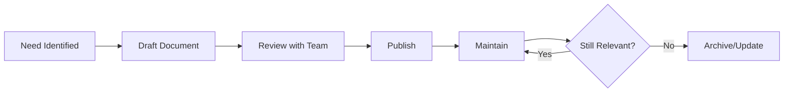

# Atlas Documentation

Welcome to the Atlas platform documentation. This directory contains platform principles and
implementation guides.

## Table of Contents

### Core Documentation

- **[ATLAS_CONTEXT.md](ATLAS_CONTEXT.md)** - Platform context and principles

  - Staff/Principal engineer perspective
  - Core technology stack
  - Enterprise-grade standards
  - Platform goals and non-goals

- **[platform-principles.md](platform-principles.md)** - Development principles and conventions
  - Architecture boundaries
  - Code organization patterns
  - Testing strategy
  - Styling conventions
  - Team collaboration guidelines

### Guides

- **[ENVIRONMENT_VARIABLES.md](ENVIRONMENT_VARIABLES.md)** - Complete environment variables guide

  - Architecture and design
  - Quick start and setup
  - Adding new variables
  - Usage patterns
  - CI/CD integration
  - Security best practices
  - Troubleshooting

- **[CONFIG.md](CONFIG.md)** - Configuration conventions and patterns

  - Config facade architecture
  - Server vs client config
  - Typed config contract
  - ESLint enforcement
  - Migration guide
  - Common patterns

- **[SENTRY.md](SENTRY.md)** - Error monitoring and performance tracing

  - Quick start and configuration
  - Client/server/edge error capture
  - Performance monitoring conventions
  - Correlation ID integration
  - Sourcemap upload setup
  - Best practices and troubleshooting

- **[SHADCN_SETUP.md](SHADCN_SETUP.md)** - shadcn/ui component library setup

  - Next.js 16 compatibility
  - 24 pre-installed components
  - Theming and customization
  - Usage examples and demo page
  - Adding new components

- **[APP_STATES.md](APP_STATES.md)** - App States UI Kit (NEW)

  - Loader patterns (Loader, InlineLoader, PageLoader)
  - Skeleton components (Skeleton, SkeletonText, SkeletonList)
  - EmptyState for "no data" scenarios
  - ErrorFallback for error boundaries
  - React Query and App Router integration
  - Accessibility and theming

- **[THEMING.md](THEMING.md)** - Theming system implementation
  - CSS-first Tailwind v4 configuration
  - Light/dark/system theme modes
  - No-flash theme switching
  - useTheme hook API
  - Design token reference

## Quick Start

### For New Team Members

1. Read [ATLAS_CONTEXT.md](ATLAS_CONTEXT.md) to understand platform philosophy
2. Review [platform-principles.md](platform-principles.md) for coding standards
3. Check [ENV_QUICK_REFERENCE.md](ENV_QUICK_REFERENCE.md) for environment setup

### For Contributors

When making changes:

1. Follow [platform-principles.md](platform-principles.md) for implementation patterns
2. Update relevant documentation when patterns change
3. Keep docs close to the code they describe

## Document Types

### Context Documents

Describe the "why" behind the platform:

- `ATLAS_CONTEXT.md` - High-level platform vision
- `platform-principles.md` - Development philosophy

### Implementation Guides

Practical how-to documentation:

- Quick reference cards
- Step-by-step guides
- Troubleshooting tips

## Finding Information

### By Topic

| Topic                 | Document                                                           |
| --------------------- | ------------------------------------------------------------------ |
| Platform Philosophy   | [ATLAS_CONTEXT.md](ATLAS_CONTEXT.md)                               |
| Coding Standards      | [platform-principles.md](platform-principles.md)                   |
| Environment Variables | [ENVIRONMENT_VARIABLES.md](ENVIRONMENT_VARIABLES.md)               |
| Config Conventions    | [CONFIG.md](CONFIG.md)                                             |
| Error Monitoring      | [SENTRY.md](SENTRY.md)                                             |
| UI Components         | [SHADCN_SETUP.md](SHADCN_SETUP.md)                                 |
| App States Kit        | [APP_STATES.md](APP_STATES.md)                                     |
| Theming System        | [THEMING.md](THEMING.md)                                           |
| Testing Strategy      | [platform-principles.md](platform-principles.md#-testing-strategy) |
| Component Design      | [platform-principles.md](platform-principles.md#component-design)  |

### By Role

**New Developers**:

1. [ATLAS_CONTEXT.md](ATLAS_CONTEXT.md)
2. [platform-principles.md](platform-principles.md)
3. [ENVIRONMENT_VARIABLES.md](ENVIRONMENT_VARIABLES.md) - Quick Start section

**Platform Engineers**:

1. [ENVIRONMENT_VARIABLES.md](ENVIRONMENT_VARIABLES.md)
2. [platform-principles.md](platform-principles.md)
3. [ATLAS_CONTEXT.md](ATLAS_CONTEXT.md)

## Contributing to Documentation

### When to Update Documentation

- **Immediate**: When changing architectural patterns or conventions
- **With PR**: When adding new features that affect team workflows
- **Quarterly**: Review and update for accuracy and relevance

### How to Update

1. **Context Docs**: Update when platform philosophy evolves
2. **Principles**: Update when adding/changing standards
3. **Guides**: Update when implementation details change

### Documentation Standards

✅ **DO**:

- Keep docs close to code they describe
- Use clear, concise language
- Include examples and diagrams
- Link to related documents
- Date significant updates

❌ **DON'T**:

- Let docs become outdated
- Duplicate information across files
- Write overly detailed docs for obvious things
- Skip context for decisions

## Documentation Architecture

```
docs/
├── README.md                    # This file - documentation index
├── ATLAS_CONTEXT.md             # Platform vision and principles
├── platform-principles.md       # Coding standards and conventions
└── ENVIRONMENT_VARIABLES.md     # Complete environment variables guide
```

## 🔗 Related Resources

### External Documentation

- [Next.js Documentation](https://nextjs.org/docs)
- [T3 Env Documentation](https://env.t3.gg/)
- [Tailwind CSS](https://tailwindcss.com/docs)
- [React Query](https://tanstack.com/query)
- [Playwright](https://playwright.dev/)

### Internal Resources

- [Web App README](../apps/web/README.md)
- [UI Package README](../packages/ui/README.md)
- [Environment Variables Guide](../apps/web/ENV.md)

## Best Practices

### Documentation Lifecycle



### Writing Tips

1. **Start with Why** - Explain context before diving into details
2. **Use Examples** - Show, don't just tell
3. **Be Concise** - Respect reader's time
4. **Stay Current** - Review quarterly, update as needed
5. **Link Liberally** - Connect related concepts

## Getting Help

### Questions About Documentation

- **Content Questions**: Open an issue or PR
- **Platform Questions**: Check [ATLAS_CONTEXT.md](ATLAS_CONTEXT.md)

### Suggesting Improvements

1. Open an issue describing the improvement
2. Or submit a PR with proposed changes
3. Tag relevant team members for review

## Documentation Metrics

We track:

- **Freshness**: Last update date on each doc
- **Completeness**: Coverage of major decisions
- **Usability**: Feedback from new team members

---

**Maintained by**: Platform Engineering Team  
**Last Updated**: December 15, 2025  
**Questions?** Open an issue or reach out to the platform team
